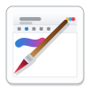
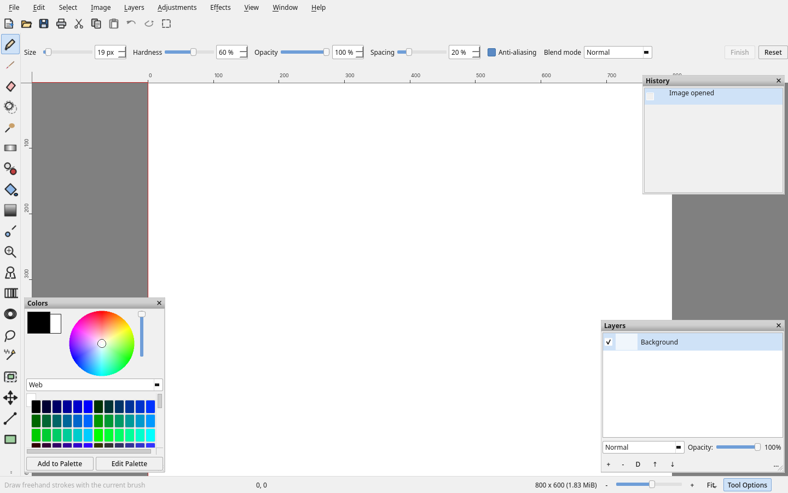
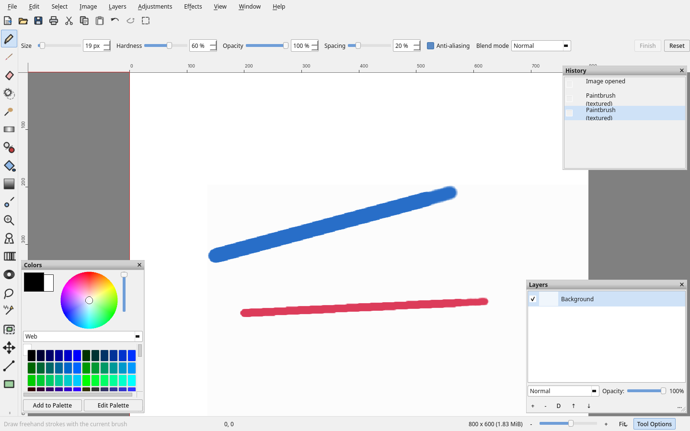
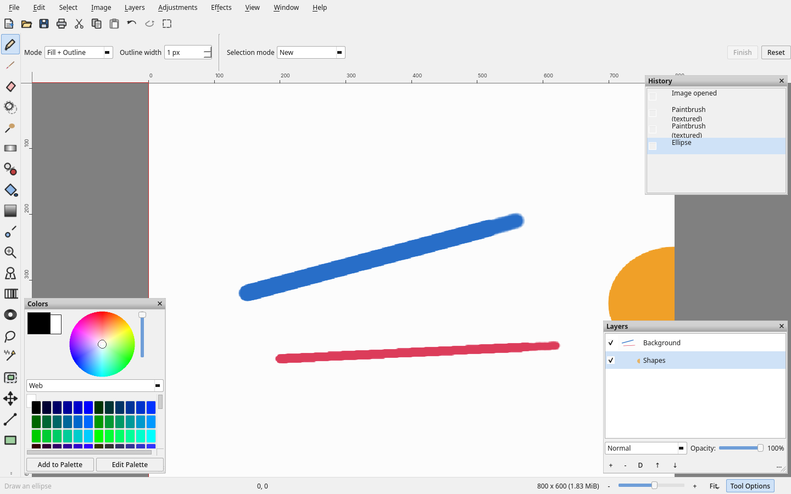

**Paint.QT**

**A raster image editor for Linux desktops, written in C++20 on Qt 6.**

[](https://github.com/RubCut/Paint.QT/actions/workflows/build.yml)
[](https://github.com/RubCut/Paint.QT/releases/latest)
[](LICENSE)

Qt 6 · C++20 · GPL-3.0-or-later · Linux and the BSDs · `.pdn`

The tool set and the palette layout are the ones people know from
[Paint.NET](https://www.getpaint.net/), and so are two further things: it reads and
writes the `.pdn` format, and its history treats one stroke as one undo step. Nothing
here comes from Paint.NET's code.

## Screenshots







## Install

**Flatpak** — one line, and the key comes with it:

```sh
flatpak install --user --noninteractive --from https://rubcut.github.io/Paint.QT/repo/io.github.RubCut.Paint.QT.flatpakref
```

GNOME Software and KDE Discover take the same `.flatpakref` URL, pasted or opened from
a browser, and both show the application before you install it.

If you would rather add the repository yourself and keep it under a name of your
choosing, that is two commands:

```sh
flatpak remote-add --user --if-not-exists --gpg-key=15CC07DFA2F7AC0DA659E4B47C5A64187D334294 paintqt https://rubcut.github.io/Paint.QT/repo
flatpak install --user paintqt io.github.RubCut.Paint.QT
```

The repository is signed with one long-lived key, so a key you trusted for one release
still verifies the next.

Two forms of this do not work, and both fail with a message that reads like a bad URL:

- `flatpak install https://…/repo io.github.rubCut.Paint.QT` — the first positional
  argument of `flatpak install` is a **remote name**, not a location, so flatpak tries to
  find a remote called `https:` and answers `'https:' is not a valid name`.
- The same command wrapped over two lines with a trailing backslash. Pasted as one line
  the backslash is an ordinary character, and the argument arrives as `\ https://…`.

**Packages** — every [release](https://github.com/RubCut/Paint.QT/releases) carries a
`.deb`, an `.rpm`, the source, a macOS bundle, an AppImage and a single-file Flatpak:

```sh
sudo apt install ./paint-qt_*_amd64.deb      # Debian, Ubuntu
sudo dnf install ./paint-qt-*.x86_64.rpm    # Fedora, openSUSE
```

**From this checkout** — either path builds and installs:

```sh
./install.sh              # native package, asks for your password
./install.sh --flatpak    # into the Flatpak, no password needed
```

**Nothing at all** — one file, no installation:

```sh
chmod +x paint-qt.AppImage && ./paint-qt.AppImage
```

## What is in it

**28 tools**

| Group | Tools |
| --- | --- |
| Drawing | Pencil, paintbrush, eraser, colour picker, gradient |
| Retouching | Blur, smudge, dodge and burn, recolour |
| Shapes | Line, rectangle, ellipse, polygon, freeform, curve |
| Text | Text with a live editing box |
| Selection | Marquee, ellipse, lasso, select opaque, move |
| Transform | Rotate, flip, scale |

**Layers** with opacity, locking, visibility, merging and flattening.

**History** where every stroke is its own step. Two strokes never collapse into one
Ctrl+Z.

**The system clipboard**, both ways: copy an image in a browser and paste it here, or
copy a selection here and paste it into anything that takes an image.

**`.pdn` files open and save losslessly**, so a document moves between the two editors
in either direction.

**Freehand strokes are smoothed** along a Catmull-Rom spline through the mouse samples,
so a fast drag comes out smooth instead of as visible chords.

The window draws its own light chrome, so it looks the same on every desktop instead of
inheriting whatever a platform's widget style happens to be.

## Build

CMake 3.21 or newer, a C++20 compiler, and Qt 6.2 or newer (`Core`, `Gui`, `Widgets`,
`Concurrent`; `Svg` is optional but recommended).

```sh
cmake -S . -B build -DCMAKE_BUILD_TYPE=Release
cmake --build build -j"$(nproc)"
./build/bin/paint-qt
```

| Platform | Packages |
| --- | --- |
| Debian, Ubuntu | `build-essential cmake ninja-build qt6-base-dev libqt6svg6-dev` |
| Fedora | `gcc-c++ cmake ninja-build qt6-qtbase-devel qt6-qtsvg-devel` |
| Arch | `base-devel cmake ninja qt6-base qt6-svg` |
| macOS (Homebrew) | `cmake ninja qt` |

## Tests

```sh
cd build && ctest --output-on-failure
```

| Suite | What it checks |
| --- | --- |
| `core_tests` | Document, history, selections, image maths |
| `gui_smoke` | The real window: layout, palettes, clipboard, zoom, undo |
| `drag_paint` | A stroke through real Qt mouse events, then undo, redo and a `.pdn` round trip |
| `tool_audit` | All 28 tools driven with real mouse events; each one has to change pixels |
| `icons` | Every tool and command has its own artwork, and the mark exists at every size |
| `packages` | Every file the packaging reads, checked before a release nobody looked at |

The `icons` suite writes `/tmp/pnq_icons.png`, a contact sheet of all the artwork.

## Packaging

Everything lives in `packaging/` and is driven by the same CMake variables, so a version
bump updates every format at once.

```sh
cd build
cpack                                        # TGZ, DEB and RPM
cpack --config CPackSourceConfig.cmake       # the source tarball
```

Every package carries the icon, the desktop entry and the AppStream metadata, so the
application shows up in a menu, in a file chooser and in a software centre with its own
artwork. The icon goes into `share/icons/hicolor` at every size, so a panel asks for the
32 px file and a file manager's large view asks for the 256 px one, neither scaled from
the other.

**macOS** — the same CMake produces a bundle with the `.icns` as its icon:

```sh
cmake -S . -B build -DCMAKE_BUILD_TYPE=Release
cmake --build build && cd build && cpack -G DragNDrop
```

**Flatpak** — `packaging/flatpak/io.github.RubCut.Paint.QT.yaml`, on `org.kde.Platform//6.11`:

```sh
packaging/flatpak/build-flatpak.sh --verify
```

It requests no privileges beyond the defaults plus the picture, document and download
directories, so the file dialog opens through the portal. CI builds the same manifest,
exports a signed ostree repository, writes the `.flatpakref`, produces a bundle and
publishes the repository to GitHub Pages. Both the script and the job first ask Flathub
which versions of the runtime it publishes, so a retired one is named rather than
surfacing halfway through a build.

**Arch** — `packaging/aur/PKGBUILD` and its generated `.SRCINFO` build from the release
tarball and verify its checksum:

```sh
git clone https://github.com/RubCut/Paint.QT.git
cd Paint.QT/packaging/aur && makepkg -si
```

## The logo

The mark is original artwork: a frame with a brush laid across it on the diagonal, a
composition Paint.NET is also known for. What is inside the frame is not a photograph but
a window this program would really show, in the KDE Breeze idiom, with a swash of paint
on its canvas.

It exists twice, deliberately:

- `packaging/icons/paint-qt.svg` ships to the icon theme and is rasterised into every PNG,
  the `.ico` and the `.icns` at build time by `tools/make_icons.cpp`.
- `src/resources/Icons.cpp` draws it procedurally, so the running application needs no
  files at all.

The `icons` test renders both and compares them, so editing one without the other fails
the build rather than quietly shipping two different logos.

## Layout

```
src/core/        document, layers, history, selections, image maths, effects
src/tools/       the 28 tools and their option panels
src/ui/          main window, canvas view, palettes, theme, dialogs
src/resources/   procedural icons and the colour palettes
tests/           six test suites
tools/           build time helpers
packaging/       everything that produces an installable package
```

## Licence

GPL-3.0-or-later. See [LICENSE](LICENSE).

Paint.NET is a registered trademark of its owner. Paint.QT is an independent work: it
contains no Paint.NET code and uses its name only to say which tool set and file format
it works with. No affiliation or endorsement is implied.